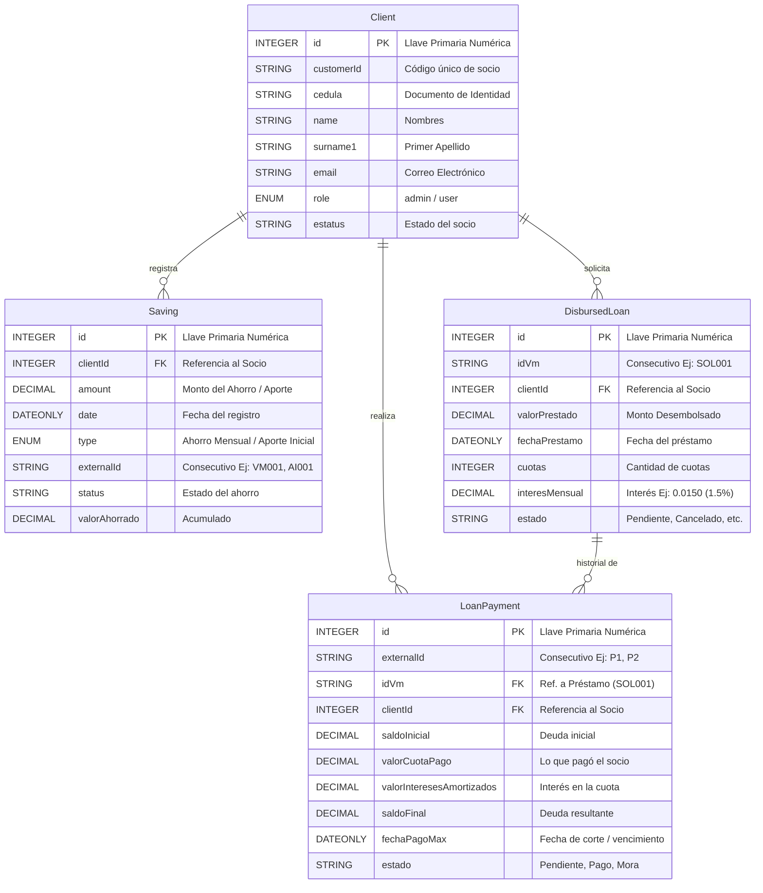
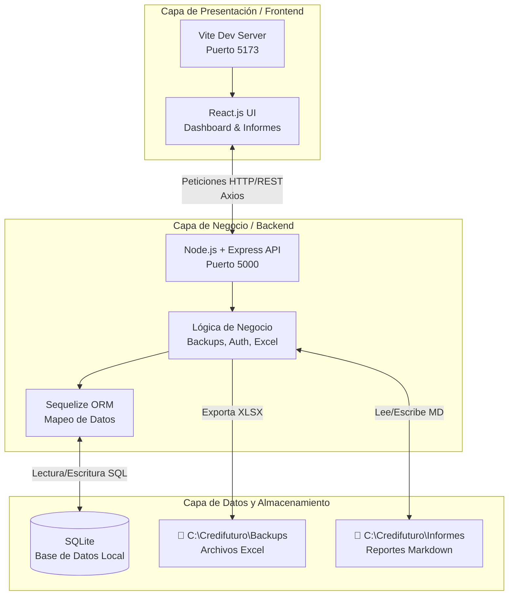

# Arquitectura de Base de Datos - Credifuturo

**Fecha del Informe:** 1 de Mayo de 2026  
**Módulo:** Auditoría y Documentación de Base de Datos  

---

## 1. Diagrama Entidad-Relación (ER)

El siguiente diagrama ilustra la estructura central de la base de datos de Credifuturo, detallando cómo se relacionan los Socios (Clientes) con sus Ahorros, Préstamos y el Historial de Pagos.

---

## 2. Arquitectura de Software (Cliente - Servidor)

El sistema Credifuturo está construido bajo una arquitectura robusta **Cliente-Servidor (Client-Server)** de tres capas, optimizada para un despliegue y uso en entornos locales (Intranet/Servidor Físico Windows).

### Componentes de la Arquitectura:
1. **El Cliente (Frontend - React):** Se ejecuta en el navegador del usuario y se encarga única y exclusivamente de la interfaz visual, renderizado de gráficos (Recharts) y parseo de markdown. No tiene conexión directa con la base de datos.
2. **El Servidor (Backend - Node/Express):** Actúa como el cerebro y el "portero" de la aplicación. Recibe peticiones del cliente mediante protocolo HTTP, valida, calcula métricas financieras, ejecuta lógica compleja de generación de Excel, y se comunica con la base de datos.
3. **Persistencia Híbrida (Storage):** 
   - Estructurada: Base de datos relacional (SQLite gestionado por Sequelize) para todo el flujo financiero.
   - Archivos: Uso del sistema de archivos de Windows (File System) para guardar y leer reportes Markdown (`C:\Credifuturo\Informes`) y respaldos masivos de Excel (`C:\Credifuturo\Backups`).

---

## 3. Diccionario de Datos por Tabla

A continuación se detallan las tablas principales del sistema, que son el motor financiero del core bancario de Credifuturo.

### 2.1 Tabla `Client` (Socios)
Almacena la información demográfica y credenciales de acceso de los socios.
- **Llave Primaria (PK):** `id` (Auto-incremental).
- **Restricciones Unique:** `cedula`, `email`, `customerId`.
- **Relaciones:** 
  - 1 a N con `Saving`
  - 1 a N con `DisbursedLoan`
  - 1 a N con `LoanPayment`

### 2.2 Tabla `Saving` (Ahorros y Aportes Iniciales)
Unifica los registros de entrada de capital de los socios. Se segmenta usando la columna `type`.
- **Llave Primaria (PK):** `id`
- **Llave Foránea (FK):** `clientId` (Apunta a `Client.id`)
- **Llave de Negocio (Unique):** `externalId` (Ej: `VM_01`, `AI_01`)
- **Detalle Financiero:** Soporta cálculos de `valorAhorrado` y `valorAPenalizar` manejando `DECIMAL(10,2)`.

### 2.3 Tabla `DisbursedLoan` (Préstamos Desembolsados)
Maneja la matriz central del crédito otorgado al socio. Es la cabecera del crédito.
- **Llave Primaria (PK):** `id`
- **Llaves Foráneas (FK):** `clientId` (Apunta a `Client.id`)
- **Llave Lógica (Business Key):** `idVm` (Consecutivo de solicitud, ej: `SOL001`). *Esta columna es usada por `LoanPayment` para agrupar las cuotas.*
- **Lógica Financiera:** `interesMensual` se almacena como `DECIMAL(5,4)` para precisión de porcentajes (ej. `0.0150` = 1.5%), y el `valorPrestado` en `DECIMAL(10,2)`.

### 2.4 Tabla `LoanPayment` (Estado de Préstamos / Cuotas)
Almacena cada cuota mensual o abono a capital realizado sobre un préstamo específico.
- **Llave Primaria (PK):** `id`
- **Llaves Foráneas (FK):** 
  - `clientId` (Apunta a `Client.id`)
  - `idVm` (Apunta a `DisbursedLoan.idVm`) - *Establece la relación directa con el crédito cabecera.*
- **Lógica de Estado:** La columna `estado` puede ser `Pendiente`, `Pago`, o `Mora`. Si es `Mora`, estos registros se separan para generar el **Reporte de Morosidad**.
- **Precisión Financiera:** Todas las métricas de saldo (`saldoInicial`, `valorCuotaPago`, `saldoFinal`) usan alta precisión `DECIMAL(12,2)`.

---

## 3. Topología y Lógica de Negocio (Business Rules)

> [!NOTE]
> **Modelo Relacional Desnormalizado Estratégico:** 
> Se observa que `LoanPayment` guarda un `clientId` directo a pesar de estar vinculado al préstamo (`idVm`). Esto es una decisión de arquitectura estratégica (desnormalización de 1er nivel) para acelerar las consultas directas ("Ver todos los pagos del Socio X") sin requerir múltiples `JOINs` por la tabla de Préstamos.

> [!TIP]
> **Generación de Reportes Excel:** 
> El módulo de `BackupService` exporta directamente estas entidades a Excel segmentando las lógicas. Por ejemplo:
> - `1-orders_table_ahorro_mensual` filtra `Saving` donde el `type = 'Mensual'`.
> - `1-orders_table_aportes_iniciales` filtra `Saving` donde el `type = 'Aporte Inicial'`.
> - `Reporte_Morosidad` filtra `LoanPayment` donde el `estado = 'Mora'`.

**Aprobado por:** Área de Arquitectura Backend - Sistema Credifuturo
